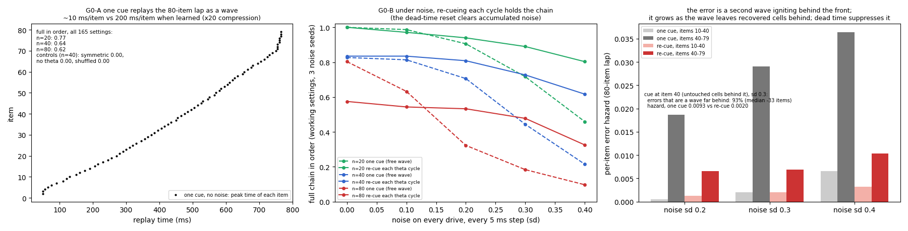

# Rytmi

*Rytmi* is Finnish for rhythm. This repo is where the TATWATASW line becomes one machine: a brain-inspired sequence learner that works in time windows and phases instead of positions and indices. It learns order with local rules, in one pass, with a fixed-size state and no backprop.

Every step is measured separately and each has a control that should fail. Run `python r1_emergent_precession.py` (about a minute), then `python make_figure_r1.py`. For G0: `python g0_chaining.py` (about a minute), then `python make_figure_g0.py`. The TATWATASW folder holds the earlier E4 code this builds on.

## The machine, and what is measured so far

| step | what it does | status |
|---|---|---|
| **Field** | One dendritic plateau per cell writes its input weights (BTSP). The written drive is asymmetric: slow rise, faster fall. | measured, TATWATASW E1 |
| **Rhythm → phase** | Rhythmic inhibition turns drive strength into spike phase. Stronger drive crosses threshold earlier in the cycle. | **measured here (R1): precession emerges, it is not imposed** |
| **Dead time** | The part of the cycle where nothing may be written, so that one compressed sequence doesn't wrap into the next. | measured: imposed on spikes (TATWATASW E3), made by a local two-trace gate (E4a), **made by the inhibition itself (R1)** |
| **Write** | Pairwise STDP writes the within-cycle order into cell-to-cell weights. | measured, TATWATASW E3 |
| **Local phase** | Two leaky traces of the local theta give each synapse its own phase estimate (fast − slow and slow, a fixed 2×2 readout). | measured, TATWATASW E4 and AnotherOddThing v5 |
| **Read** | Cue one cell; the written chain replays forward, in order. | measured (replay grid of 165 settings) |
| **Chain** | Replay the whole learned sequence from one cue, and keep it in order under noise. | **measured here (G0): one cue carries 80 items; re-cueing each theta cycle is what keeps it in order under noise** |

## R1 — phase precession emerges

**Setup.** Nothing in R1 sets a spike phase.

- **Inputs.** 70 upstream place inputs.
- **Fields.** Each of 20 target cells gets one plateau at its own location, and TATWATASW E1's BTSP rule writes its input weights. The resulting drive rises over 1.74 s and falls over 0.83 s (20%-of-peak points).
- **Rhythm.** Inhibition is A(1 + cos Φ)/2. Its frequency wanders around 8 Hz and its amplitude drifts, as in E4.
- **Cells.** Leaky integrate-and-fire, with spike-triggered adaptation and membrane noise.
- **Learning.** The spikes go into E3's plain STDP (±20 ms) with no gate, over 20 laps. Then the middle cell is cued on E3's 165-setting replay grid.

**Results.**

| condition | spikes / cell / lap | asymmetry index | replay forward-only, in order | 3 fresh seeds |
|---|---|---|---|---|
| **asymmetric field (BTSP window reaches back)** | 11.4 | **0.996** | **0.95** | 0.79–0.87 |
| symmetric field | 10.8 | 0.945 | 0.06 (0.78 forward but out of order) | 0.07–0.37 |
| no theta, constant inhibition set to match the spike count | 11.3 | 0.439 | 0.09 (0.75 reach a cell behind the cue) | 0.05–0.37 |
| asymmetric spikes, each moved to a random phase inside its **own** theta cycle | 11.3 | 0.175 | 0.00 | 0.00–0.04 |

- **Precession emerges from drive against inhibition.** The mean phase of the first spike per cycle moves from 0.51 to 0.33 of the cycle as the cell's drive ramps up (circular-linear ρ = 0.76 over the entering half). Then it recedes after the peak. A range of about 0.2 cycle (≈ 70°) is smaller than the up-to-360° seen in rats. It is emergent, but not full-size.
- **That emergent timing is enough for plain STDP to write a replayable sequence.** 0.95 forward-in-order, matching the 0.96 that TATWATASW E3 got with precession *written in by formula*.
- **The timing is what carries it.** The phase-shuffled control keeps every spike, every cell and every theta cycle, and only scrambles order inside each cycle. It drops to 0.00. The rate-matched no-theta control mostly replays backward too.
- **The rhythm's inhibition supplies its own dead time.** In the working regime, 45% of the cycle is effectively empty of spikes. So E4a's local phase gate is not needed here. Adding it (30% closed) changes 0.89 to 0.88.

**Why the plateau's asymmetry matters.** Both field shapes precess while the drive rises (ρ 0.76 and 0.80). The difference is how much firing happens on the way *down*. With the asymmetric field, 36% of spikes come after the drive peak; with the symmetric field it's 47%. Receding spikes run the within-cycle order backward. With a symmetric field there are enough of them to smear the order: the replay stays mostly forward (asymmetry 0.945) but loses sequence.

This corrects TATWATASW E2. There, the plateau's asymmetry could not write a sequence on its own. Here it turns out to be *necessary* for the rhythm to write one. The tuft and the rhythm are not alternatives; the tuft shapes the field so the rhythm's phase code comes out one-directional. Experience-dependent backward skew of place fields is a measured effect in rats (Mehta et al. 2000). R1 shows what it buys in this machine.

**Where it breaks.** The robustness grid covers peak excitation P ∈ {2.2, 2.6, 3.0} (threshold 1) and inhibition swing A ∈ {1.6, 2.4, 3.2}, with 12 laps each.

- **Asymmetric fields pass in 7 of 9 settings,** at 0.81–0.94.
- **Symmetric fields pass in none,** staying at 0.15 or below everywhere.
- **The two failures are where excitation outruns inhibition** (P − 1 ≥ A): 0.24 and 0.01. There, cells fire more often per cycle (13–16 spikes per lap against 9–12), the empty arc shrinks to 0.17 of the cycle, and the written links reach further. The replay stays forward (0% backward at P 2.6, A 1.6) but out of order, the same failure as TATWATASW E4b.
- **The E4a local gate does not rescue these cases** (0.25 and 0.00). The problem is too many spikes per cycle, not wrap-around. So the operating condition is plain: inhibition must be strong enough to hold each cell to about one burst per cycle.

## What R1 means for Rytmi

The chain **plateau → asymmetric field → rhythmic inhibition → emergent precession → STDP → ordered replay** now runs in one machine, with no phase variable anywhere. Each link has a control that breaks it:

- **A symmetric plateau** breaks the order.
- **No rhythm** breaks it.
- **Scrambled within-cycle timing** breaks it.
- **Too little inhibition** breaks it.

## Ledger

- **The mechanism is known.** Precession from a rising excitatory ramp against oscillating inhibition is the Mehta, Lee & Wilson (2002) account; related models include Kamondi et al. (1998), Harris et al. (2002) and Magee (2001). Theta sequences writing asymmetric recurrent weights through STDP is also established. What R1 adds is the *measured chain* in one small model, with matched controls for each link.
- **Still imposed:**
  - where each cell's plateau happens (one per cell, at its place, as if an instructive signal chose it)
  - the upstream place inputs
  - one theta rhythm shared by all cells
  - the cell parameters (the grid shows the working region, not a fit)
- **Precession is partial:** about 0.2 cycle, then recession. Real place cells can precess through a full cycle.
- **The spike count is higher than TATWATASW E3's** (11 against about 5 per cell per lap), so forward drive per spike (1.19 here, 0.61 there) is not a like-for-like efficiency comparison. The replay fractions are comparable.
- **"Empty arc"** is the widest part of the cycle where the spike density falls below 10% of uniform. It is a descriptive measure, not a model parameter.
- **The replay network and its 165-setting grid** are TATWATASW's, unchanged.

## G0 — chaining: one cue, a whole lap, and what noise does to it

The plan was to re-cue on replay, because TATWATASW E3's weights reached only 1.2–1.4 items forward. R1's emergent weights reach about 3 items. So the first question was whether re-cueing is needed at all.

**A — one cue replays the whole lap.** Learn R1's machine unchanged on laps of 20, 40 and 80 items, cue item 0 once, add no noise, and score all 165 replay settings.

| lap length | full lap replayed in order | median in-order reach | replay speed |
|---|---|---|---|
| 20 | 0.77 | 19 | 15 ms/item |
| 40 | 0.64 | 39 | 15 ms/item |
| 80 | 0.62 | 79 | 10 ms/item |
| 40, symmetric field | 0.00 | 4 | |
| 40, no theta (rate matched) | 0.00 | 0 | |
| 40, phase-shuffled | 0.00 | 35 | |

- **The replay is a travelling wave.** Each written link reaches about 3 items, so activity keeps itself going. No re-cue is needed for length.
- **It runs 13–20× faster than the sequence was experienced** (200 ms per item when learned). That is the same order of compression reported for hippocampal replay.
- **None of R1's controls can replay a 40-item lap in order.**

**B — noise.** White noise is added to every cell's drive at every 5 ms step. Two ways of reading the chain are compared, each on its own working settings (those where its noiseless 20-item replay is fully in order; 127 of 165 for both), over three noise seeds:

- **one cue:** the wave runs on by itself.
- **re-cue each theta cycle:** 75 ms open, then 50 ms of dead time with all activity silenced. The next cue is the last item that peaked in the previous cycle.

| full chain in order | noise 0 | 0.1 | 0.2 | 0.3 | 0.4 |
|---|---|---|---|---|---|
| 20 items, one cue | 1.00 | 0.99 | 0.91 | 0.72 | 0.46 |
| 20 items, re-cue | 1.00 | 0.97 | 0.94 | **0.89** | **0.80** |
| 40 items, one cue | 0.83 | 0.81 | 0.71 | 0.44 | 0.22 |
| 40 items, re-cue | 0.83 | 0.83 | 0.81 | **0.73** | **0.62** |
| 80 items, one cue | **0.80** | **0.63** | 0.32 | 0.18 | 0.10 |
| 80 items, re-cue | 0.57 | 0.54 | **0.53** | **0.48** | **0.33** |

**C — what the errors are.** At the first out-of-order item, I checked where it sits relative to the front of the replay.

- **Starting at item 0 (noise 0.3):** about two-thirds of errors are local swaps 1–5 items behind the front. The other third are items far behind it.
- **Starting at item 40,** where every cell behind the cue is untouched: 93% of errors are far behind, a median of 33 items back.
- **So the main error is a second wave igniting somewhere else,** in excitable cells the front isn't occupying. Adaptation normally protects the cells the wave has just passed. Once that wears off (tau 0.25 s), or if the cells were never visited, noise can start a new wave there.
- **That is why the one-cue wave's error rate grows along the chain.** Per item, it rises from 0.002 over items 10–40 to 0.029 over items 40–79 (noise 0.3), because the recovered territory behind the front keeps growing.
- **The dead time kills these ignitions every cycle,** before they grow. With re-cueing, the late-chain rate stays at 0.007 per item. From item 40 it's 0.0020 against 0.0093 for one cue.

**What G0 means.**

- **Length was never the problem.** R1's learned weights carry an 80-item sequence from a single cue, compressed about 15×.
- **The problem is spurious waves,** and the rhythm's dead time is what suppresses them. That gives the dead time a second job. In learning (TATWATASW E3, R1) it keeps one compressed sequence from wrapping into the next. In recall (G0) it stops noise from starting a second replay behind the first.
- **Re-cueing has a cost.** Without noise, the 80-item re-cue does worse (0.57 against 0.80). At low thresholds, a re-cue after about 50 items can re-ignite an earlier stretch (typically 15–40 items back), presumably where adaptation has worn off. That is the same error in a deterministic form. The crossover is around noise 0.15 at 80 items: below it, one cue is better; above it, re-cueing is much better.

**Ledger (G0).**

- **About 20% of settings can't launch the 80-item lap from item 0** in either mode. The first item has only forward partners, and all weights are normalized to the matrix's single largest weight. This is an edge effect of the setup, not of chaining.
- **Each mode's working settings were chosen on its own noiseless 20-item replay.** Longer laps reuse those settings unchanged.
- **Noise is additive and white on the replay network's drive.** The replay network is TATWATASW's rate model with adaptation, not R1's spiking cells. Learning uses the spiking model; recall does not.
- **The re-cue rule** ("the last item that peaked") and the 75/50 ms split are my choices, not swept.

## Next gates

- **G1 — one-shot capacity.** Show K new sequences once each; recall versus K at a fixed state size. Baseline: an asymmetric Hopfield sequence memory (Sompolinsky & Kanter 1986).
- **G2 — plateaus that choose themselves.** Replace "one plateau per cell at its place" with plateaus triggered by local surprise (prediction error). That turns the field step into learning instead of an input.

## Lineage

AnotherOddThing v5 (fast − slow separates entering from leaving at the same level) → TATWATASW E1–E3 (plateau writes predictive fields; rhythm plus dead time writes order) → TATWATASW E4 (two traces as a local phase; dead time made locally; direction without rhythm) → **Rytmi R1** (precession emerges from plateau-written drive against rhythmic inhibition, and plain STDP writes ordered replay from it) → **Rytmi G0** (one cue replays an 80-item lap as a compressed wave; the dead time suppresses spurious second waves under noise).

## References

- Mehta, M. R., Quirk, M. C. & Wilson, M. A. (2000). Experience-dependent asymmetric shape of hippocampal receptive fields. *Neuron* 25, 707–715.
- Mehta, M. R., Lee, A. K. & Wilson, M. A. (2002). Role of experience and oscillations in transforming a rate code into a temporal code. *Nature* 417, 741–746.
- Kamondi, A., Acsády, L., Wang, X.-J. & Buzsáki, G. (1998). Theta oscillations in somata and dendrites of hippocampal pyramidal cells in vivo. *Hippocampus* 8, 244–261.
- Harris, K. D. et al. (2002). Spike train dynamics predicts theta-related phase precession in hippocampal pyramidal cells. *Nature* 417, 738–741.
- Magee, J. C. (2001). Dendritic mechanisms of phase precession in hippocampal CA1 pyramidal neurons. *J. Neurophysiol.* 86, 528–532.
- Bittner, K. C. et al. (2017). Behavioral time scale synaptic plasticity underlies CA1 place fields. *Science* 357, 1033–1036.
- Kempter, R., Leibold, C., Buzsáki, G., Diba, K. & Schmidt, R. (2012). Quantifying circular–linear associations. *J. Neurosci. Methods* 207, 113–124.
- Sompolinsky, H. & Kanter, I. (1986). Temporal association in asymmetric neural networks. *Phys. Rev. Lett.* 57, 2861–2864.
