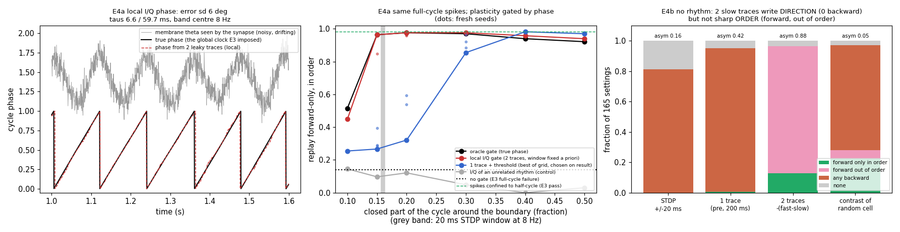

# TATWATASW — Tokens As Time Windows And Tuft As Sequence Writer

Four small CPU experiments (numpy/scipy) testing two ideas from the notes that followed FrequencyAndNeurons and GATGRILS v1:

1. **Tuft as sequence writer.** A dendritic plateau in the apical tuft is a *write-enable*. It potentiates whatever inputs were active in a window around it (behavioral-timescale plasticity, BTSP; Bittner et al. 2017). Can it write *sequences*?
2. **Tokens as time windows.** A rhythm compresses a slow series into phase order inside each cycle, one item per window, so that fast spike-timing plasticity (STDP) can write that order into the weights.

Each experiment includes the control that should fail. Run `python tatwatasw.py` (E1–E3, under a minute), then `python make_figure.py`. E4 is separate: `python e4_local_phase.py` (about 3.5 minutes including the fresh-seed check), then `python make_figure_e4.py`.

## Results (`results.json`)

### E1 — the plateau writes a *predictive* field

The setup is 40 upstream cells with sequential time fields over a 4 s lap, and one plateau in the target's tuft at 2.4 s.

| rule | field peak vs plateau | field centre of mass | width | skew |
|---|---|---|---|---|
| **asymmetric window** (reaches back 1.0 s, forward 0.35 s) | **−120 ms** | **−374 ms** | 1135 ms | −0.54 |
| symmetric window | 0 ms | −1 ms | 1040 ms | 0.0 |
| Hebbian (same instruction as a 200 ms somatic pulse) | 0 ms | −3 ms | 495 ms | 0.0 |

A single plateau with a backward-reaching window gives the cell a field that fires *before* the plateau location. In other words, it anticipates. The same instruction without the extended window gives a narrow, centred field.

### E2 — but the same plateau rule does **not** write a directional chain

The setup is six target cells with plateaus 600 ms apart. The same rule writes the target→target synapses. Then the middle cell is cued with no upstream input, over 165 settings of gain and threshold.

| rule | neighbour forward/backward weight | whole-matrix forward/backward | replay forward-only, in order | replay in both directions |
|---|---|---|---|---|
| asymmetric | 1.20 | 1.71 | **1%** | 98% |
| symmetric | 0.98 | 0.98 | 0% | 99% |
| Hebbian | — (fields don't overlap, no weights) | — | 0% | 0% (nothing fires) |

The plateau rule writes only a weak order. Each cell's own predictive field reaches back and overlaps the plateau of the cell *before* it, which cancels most of the asymmetry between neighbours. Replay spreads both ways. **The plateau gives predictive fields; it does not, on its own, give sequences.**

### E3 — the rhythm makes order writable, and the dead time is what protects it

The setup is 20 cells with fields 200 ms apart, far outside a ±20 ms STDP window. Spikes are generated four ways with matched spike counts, then pairwise STDP runs for 20 laps. Finally the middle cell is cued over the same 165-setting grid.

| spike timing (8 Hz theta) | net forward weight per spike | replay forward-only, in order |
|---|---|---|
| **phase precession, spikes in the excitable half-cycle** | **0.607** | **96%** |
| phase precession spread over the whole cycle | 0.059 | 8% |
| one fixed phase (synchronous) | −0.017 | 22% |
| rate only (Poisson, same count) | 0.065 | 1% (mostly nothing fires) |

- **Compression makes order learnable.** When each theta cycle replays the local stretch of the sequence in order, a few milliseconds apart, STDP writes forward connections: 9× the per-spike drive of rate coding alone. Cueing the middle cell then replays the rest forward, in order, in 96% of settings.
- **The dead time is necessary.**
  - When the compressed sequence fills the *whole* cycle, the last item of one cycle lands right before the first item of the next. Those wrap-around pairs are written backward and cancel the order (0.059; at 4 Hz it even turns negative, −0.027).
  - Confining firing to the excitable half of the cycle, with inhibitory dead time in the rest, removes the wrap-around.
  - This is the FrequencyAndNeurons result in a new role. There, slower inhibition bought dead time rather than wider slots. Here, that dead time is what keeps the series writable.

**Theta sweep (4–12 Hz, windowed precession):** forward drive per spike is 0.33 / 0.53 / 0.61 / 0.57. The forward reach stays at 1.2–1.4 items and does *not* grow with slower theta. What limits it is how far apart neighbouring items land in time compared with the STDP window, not how many items fit in a cycle. So "slower theta, more capacity" is not supported in this form.

### E4 — delete the clock: two leaky traces as a local phase

*Code: `e4_local_phase.py`. Results: `results_e4.json`. Figure: `e4.png`.*

**Why this should work at all.** A fast leaky trace minus a slow one is a band-pass filter, H(ω) = 1/(1+iωτ_f) − 1/(1+iωτ_s). It peaks at ω\* = 1/√(τ_f τ_s). At that frequency the contrast (fast − slow) and the slow trace sit at a fixed, known phase offset from each other. So a fixed 2×2 linear readout of those two local variables gives the phase of a rhythm near ω\*, independent of its amplitude. That is the same second state AnotherOddThing v5 showed separates "entering" from "leaving." Here it is used as a local clock.

The synapse sees only a noisy membrane theta oscillation. Its frequency wanders (OU process around 8 Hz, sd 0.6 Hz), its amplitude drifts (log-normal, sd 0.4) and white noise is added. With τ_f = 6.6 ms and τ_s = 59.7 ms, the phase read from the two traces has an error of **6° (sd), with a 1° bias**.

**E4a — local dead time rescues E3's failing condition.** The spike trains are E3's failing case: precession spread over the *whole* cycle, with no dead time, now locked to the wandering rhythm. Nothing in the spikes changes. The only change is that a spike pair writes only if both spikes fall in the open part of the cycle. The window is fixed in advance, not tuned on the result.

| closed part of cycle | oracle gate (true phase) | **local gate (2 traces)** | 1 trace + threshold (best of grid, *chosen on the result*) | 2 traces fed an unrelated rhythm |
|---|---|---|---|---|
| 0.10 | 0.52 | 0.45 | 0.25 | 0.15 |
| 0.15 | 0.96 | **0.96** (fresh seeds 0.85–0.96) | 0.27 (0.28–0.39) | 0.10 |
| 0.20 | 0.98 | **0.98** (0.96) | 0.32 (0.32–0.59) | 0.12 |
| 0.30 | 0.97 | **0.98** (0.96–0.98) | 0.85 (0.88–0.96) | 0.05 |
| 0.40–0.50 | 0.92–0.94 | 0.94–0.96 | 0.97–0.98 | ≤ 0.03 |

Fractions are "replay forward-only, in order" over E3's 165 settings. The references: no gate 0.14 (fresh seeds 0.15–0.23), and spikes confined to half the cycle (E3's pass) 0.98.

- **The local phase does the oracle's job.** With 15–30% of the cycle closed, the two-trace gate matches the true-phase gate. Order is restored from 0.14 to 0.96–0.98 with no global phase variable anywhere in the learning rule.
- **The information is in the phase, not in the thinning.** The same two-trace machinery fed an unrelated rhythm closes a similar fraction of spikes and rescues nothing.
- **Two traces beat one where the dead time is narrow.** A single thresholded trace can also make a window, but its width follows the rhythm's amplitude, which it cannot know. At 15–20% closed it reaches 0.27–0.59 even when given its best setting after the fact. Once the dead time is wide (≥ 40%), one trace is enough. So the claim is specific: **the second state earns its place when the dead time must be narrow and the rhythm's amplitude drifts.**
- **How much dead time is needed:** between 10% and 15% of the cycle. That is about one STDP time constant at this theta frequency (20 ms × 8 Hz = 0.16). Less than that, and wrap-around pairs still reach each other across the gap.
- **What the gate does not recover:** forward drive per spike. It stays at 0.09, against 0.64 when the spikes themselves are compressed into half a cycle. The gate fixes the *direction* of what is written but not its *efficiency*. Compressed spikes put neighbours closer together in time.

**E4b — no rhythm at all.** The inputs are Poisson spikes from the same place fields, with no theta and no precession. At each post spike, the synapse reads the pre cell's traces at *field* timescale (τ_f = 80 ms, τ_s = 320 ms, band centre about 1 Hz). The rule "potentiate when the pre cell is falling" is ΔW[i,j] += −(fast_j − slow_j) at the post spike. This is differential Hebbian learning (Kosko 1986; Klopf 1988), which is known to be closely related to STDP (Rao & Sejnowski 2001).

| rule (4 seeds) | asymmetry index | replay reaches a cell *behind* the cue | forward only, in order | forward only, out of order |
|---|---|---|---|---|
| STDP ±20 ms | 0.16–0.56 | 0–81% | 0–66% | 0–22% |
| 1 trace (pre, 200 ms) | 0.42–0.44 | 89–95% | 1–4% | 0–2% |
| **2 traces, −(fast − slow)** | **0.81–0.88** | **0% in every seed** | 4–15% | **81–87%** |
| contrast of a random other cell | 0.02–0.07 | 38–69% | 0–35% | 5–13% |

- **Two slow traces write direction without any rhythm.** Across four seeds, the replay never went backward.
- **They do not write sharp order.** The written connections reach 3.4 items forward, so cueing the middle cell lights the next few cells nearly together, not in sequence.
- **Rate-only STDP is noise-dominated here.** It ranges from 0% to 66% forward-in-order depending on the seed, because too few spike pairs land within 20 ms. It is not a stable baseline in either direction.

**What E4 means.** The rhythm and the local traces now have separate, measured jobs:

- **Direction** can come from two local traces alone, at behavioural timescale, with no rhythm (E4b).
- **Sharp neighbour-to-neighbour order,** the kind that replays in sequence, still needs the compression that a rhythm provides (E3 vs E4b).
- **The dead time** that protects that order does not have to be imposed on the spikes or handed to the synapse as a phase variable. Two leaky traces of the local theta oscillation can generate it (E4a).

In other words, Huerta & Lisman's phase-dependent plasticity (1995) and Hasselmo's separate encoding and retrieval phases (2002) can be implemented by each synapse reading its own two-trace phase.

## What it means

**The two ideas are halves of one mechanism, not rivals.**

- **The tuft plateau decides *what and where*.** It writes a predictive field for a location or item, anchored to an instructive event (E1). By itself it doesn't write order between cells (E2).
- **The rhythm decides *in what order*.** It turns a slow series into windows of compressed order separated by dead time, and fast plasticity writes that order into the weights (E3).
- **Put together:** a series becomes a chain only when it passes through time windows, and a plateau makes a cell's field anticipate its place in that chain.

**"Tokens as time windows" is supported here in a specific sense.** A window is the unit in which order becomes learnable. The windows need gaps between them, and those gaps are set by inhibition, not by how many items must be stored.

**For the earlier repos:**
- **The weak apical door** in KolmeOvea's trained follow-up and in GATGRILS v1 was only tested at *inference*. E1 shows the plateau's strongest effect is on what gets *learned*, and E2 shows that even then it doesn't carry order. Order needs the rhythm.
- **FrequencyAndNeurons' dead time** is load-bearing: it is what makes the rhythm's order writable.

## Ledger

- **Everything is imposed, not emergent.** The fields, the plateau times, phase precession itself (spike phases are set by a formula) and the theta rhythm are all given. What the repo tests is which *learning rules* turn those timing patterns into order.
- **The BTSP window's shape and time constants are my choice,** loosely following Bittner et al. (2017): longer before the plateau than after. They are not fitted to data.
- **E1's predictive shift follows from the kernel shape by construction.** It's a known-answer check.
- **E2 is a genuine negative for a single plateau per cell.** Repeated plateaus, dendritic nonlinearities, or plasticity at recurrent synapses with a different rule could change it.
- **E3 uses rate-matched spike counts** and one pairwise, additive STDP rule (±20 ms, balanced). The rate-only control's small forward bias comes from the rate gradient between neighbouring fields, a known effect.
- **E4 still imposes a lot.** Phase precession itself is still written into the spike times by formula, and all cells share one theta rhythm. What E4 removes is the phase *variable* in the learning rule and the dead time in the spikes. It does not explain where precession comes from.
- **E4's local phase uses a fixed 2×2 readout.** It is computed from the filters' own transfer function at 8 Hz (a constant of the synapse, not fitted to data). The rhythm is sinusoidal-ish; a strongly non-sinusoidal theta would bias the estimate.
- **E4a's one-trace attacker was tuned on the result** (best of 5 time constants × 2 signs, with its threshold set to the same open fraction). The two-trace gate was not tuned. That asymmetry favours the attacker.
- **E4b's time constants** (80/320 ms) were chosen to match the field width (σ = 250 ms), not swept.
- **The replay model is a rate network with adaptation.** "Forward-only, in order" is scored over a fixed grid of 165 gain/threshold settings, so the fractions measure robustness, not a tuned best case.

## Place in the lineage

SilentPing → KolmeOvea (three doors) → KolmeOvea trained (apical door weak at inference) → FrequencyAndNeurons (window width set by loop physics; slower inhibition buys dead time) → GATGRILS v1 (silent resident state readable by ping; no clean three-way split) → **TATWATASW**. Here the tuft is a write-gate for predictive fields, and rhythm plus dead time is what makes a series writable as order. **E4** takes AnotherOddThing v5's second state (fast − slow) and shows it can act as a local phase: it replaces the imposed dead time, and at slow timescales it writes direction with no rhythm at all.

## References

- Bittner, K. C., Milstein, A. D., Grienberger, C., Romani, S. & Magee, J. C. (2017). Behavioral time scale synaptic plasticity underlies CA1 place fields. *Science* 357, 1033–1036.
- O'Keefe, J. & Recce, M. L. (1993). Phase relationship between hippocampal place units and the EEG theta rhythm. *Hippocampus* 3, 317–330.
- Skaggs, W. E., McNaughton, B. L., Wilson, M. A. & Barnes, C. A. (1996). Theta phase precession in hippocampal neuronal populations and the compression of temporal sequences. *Hippocampus* 6, 149–172.
- Foster, D. J. & Wilson, M. A. (2007). Hippocampal theta sequences. *Hippocampus* 17, 1093–1099.
- Lisman, J. E. & Jensen, O. (2013). The theta-gamma neural code. *Neuron* 77, 1002–1016.
- Huerta, P. T. & Lisman, J. E. (1995). Bidirectional synaptic plasticity induced by a single burst during cholinergic theta oscillation in CA1 in vitro. *Neuron* 15, 1053–1063.
- Hasselmo, M. E., Bodelón, C. & Wyble, B. P. (2002). A proposed function for hippocampal theta rhythm: separate phases of encoding and retrieval enhance reversal of prior learning. *Neural Computation* 14, 793–817.
- Kosko, B. (1986). Differential Hebbian learning. *AIP Conference Proceedings* 151, 277–282. Klopf, A. H. (1988). A neuronal model of classical conditioning. *Psychobiology* 16, 85–125.
- Rao, R. P. N. & Sejnowski, T. J. (2001). Spike-timing-dependent Hebbian plasticity as temporal difference learning. *Neural Computation* 13, 2221–2237.
- Vaswani, A. et al. (2017). Attention is all you need. *NeurIPS*. Su, J. et al. (2021). RoFormer: rotary position embedding. arXiv:2104.09864. (Transformers already encode order as phase.)
